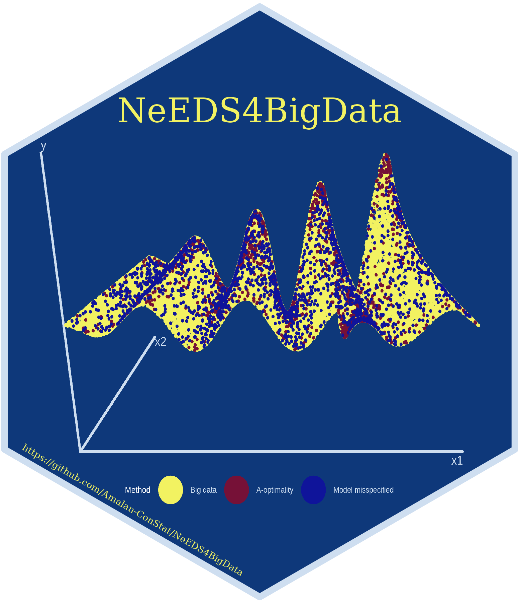

# NeEDS4BigData 

<!-- badges: start -->

[](https://cran.r-project.org/package=NeEDS4BigData)
[](commits/main)
[](https://cran.r-project.org/package=NeEDS4BigData)
[](https://lbesson.mit-license.org/)

[](https://cran.r-project.org/package=NeEDS4BigData)
[](https://cran.r-project.org/package=NeEDS4BigData)
[](https://cran.r-project.org/package=NeEDS4BigData)

[](https://www.repostatus.org/#active)
[](https://lifecycle.r-lib.org/articles/stages.html#stable)
[](https://github.com/Amalan-ConStat/NeEDS4BigData/issues)

[](https://codecov.io/gh/Amalan-ConStat/NeEDS4BigData)
[](https://www.codefactor.io/repository/github/Amalan-ConStat/NeEDS4BigData)
[](https://github.com/Amalan-ConStat/NeEDS4BigData)

[](https://doi.org/10.1007/s00362-023-01446-9)
<!-- badges: end -->

*The R package “NeEDS4BigData” holds subsampling methods that can be
implemented over big data.*

### How did the name “NeEDS4BigData” came through ?

*Ne*w *E*xperimental *D*esign based *S*ubsampling methods *for Big
Data*.

### How to engage with “NeEDS4BigData” the first time ?

``` r
## Installing the package from GitHub
devtools::install_github("Amalan-ConStat/NeEDS4BigData")

## Installing the package from CRAN
install.packages("NeEDS4BigData")
```

### What does “NeEDS4BigData” ?

Algorithms are implemented under Generalised Linear Models (GLMs) for
big data to obtain informative subsamples.

### Subsampling Methods

1.  A- and L-optimality based subsampling for GLMs.
2.  A-optimality based subsampling for Gaussian Linear Models.
3.  Leverage sampling for GLMs.
4.  Local case control sampling for logistic regression.
5.  A-optimality based subsampling under measurement constraints for
    GLMs.
6.  Model Robust subsampling method for GLMs.
7.  Subsampling method for GLMs when the model is potentially
    misspecified.

To explain these methods in detail $7$ articles are written and they
are,

1.  Introduction - explains the need for subsampling methods.
2.  Linear Regression - Basic sampling.
3.  Linear Regression - Model robust and misspecification.
4.  Logistic Regression - Basic sampling.
5.  Logistic Regression - Model robust and misspecification.
6.  Poisson Regression - Basic sampling.
7.  Poisson Regression - Model robust and misspecification.

Here, for $2,4$ and $6$ we assume the main effects model can describe
the data. While for $3,5$ and $7$ first we consider there are several
models that can describe the big data, then later we assume the given
main effects model is misspecified. Under these conditions from $2-7$ we
explore subsampling for $3$ given big data sets.

#### Thank You

[](https://twitter.com/intent/tweet?text=Wow:&url=https%3A%2F%2Fgithub.com%2FAmalan-ConStat%2FNeEDS4BigData)

[](https://www.linkedin.com/in/amalan-mahendran-72b86b37/)
[](https://www.researchgate.net/profile/Amalan_Mahendran)
