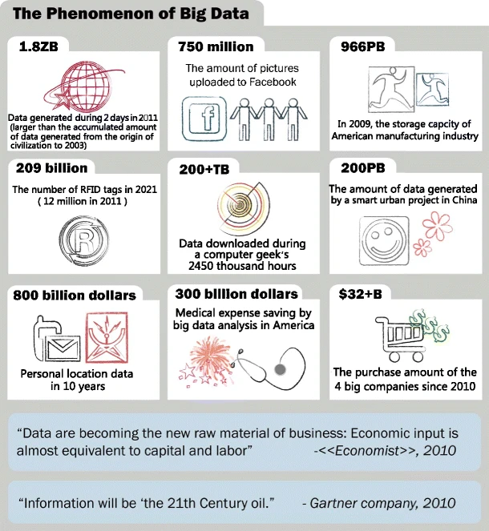

## Big data analysis

Big data presents opportunities for analysts to uncover new knowledge and gain new insights into real-world problems.
However, its massive scale and complexity presents computational and statistical challenges. 
These include scalability issues, storage constraints, noise accumulation, spurious correlations, incidental endogeneity and measurement errors. 
In Figure 1, @chen2014big review the size of big data for different sectors of business.
Addressing these challenges demands innovative approaches in both computation and statistics.
Traditional methods, effective for small and moderate sample sizes, often falter when confronted with massive datasets.
Thus, there is a pressing need for innovative statistical methodologies and computational tools tailored to the unique demands of big data analysis.

## Computational solutions for big data analysis

Computer engineers often seek more powerful computing facilities to reduce computing time, leading to the rapid development of supercomputers over the past decade. 
These supercomputers boast speeds and storage capacities hundreds or even thousands of times greater than those of general-purpose PCs. 
However, significant energy consumption and limited accessibility remain major drawbacks. 
While cloud computing offers a partial solution by providing accessible computing resources, it faces challenges related to data transfer inefficiency, privacy and security concerns. 
Graphic Processing Units (GPUs) have emerged as another computational facility, offering powerful parallel computing capabilities. 
However, recent comparisons have shown that even high-end GPUs can be outperformed by general-purpose multi-core processors, primarily due to data transfer inefficiencies. 
In summary, neither supercomputers, cloud computing, nor GPUs have efficiently solved the big data problem. 
Instead, there is a growing need for efficient statistical solutions that can make big data manageable on general-purpose PCs.

## Statistical solutions for big data analysis

In the realm of addressing the challenges posed by big data, statistical solutions are relatively novel compared to engineering solutions, with new methodologies continually under development. 
Currently available methods can be broadly categorized into three groups:

1. Sampling: This involves selecting a representative subset of the data for analysis instead of analysing the entire dataset. This approach can significantly reduce computational requirements while still providing valuable insights into the underlying population.
2. Divide and conquer: This approach involves breaking down the large problem into smaller, more manageable sub problems. Each sub problem is then independently analysed, often in parallel, before combining the results to obtain the final output.
3. Online updating of streamed data: The statistical inference is updated as new data arrive sequentially.

In recent years, there has been a growing preference for sampling over divide and recombine methods in addressing a range of regression problems. 
Meanwhile, online updating is primarily utilized for streaming data. 
Furthermore, when a large dataset is unnecessary to confidently answer a specific question, sampling is often favoured, as it allows for analysis using standard methods.

## Sampling algorithms for big data

The literature presents two strategies to resolve the primary challenge of how to acquire an informative subset that efficiently addresses specific analytical questions to yield results consistent with analysing the large data set. 

They are:

1. Sample randomly from the large dataset using subsampling probabilities determined via an assumed statistical model and objective (e.g., prediction and/or parameter estimation) [@wang2018optimal;@yao2019softmax;@ai2020quantile;@ai2021optimal;@lee2021fast;@zhang2021optimal;@lee2022sampling]
2. Select samples based on an experimental design [@drovandi2017principles;@wang2019information;@cheng2020information;@hou2023generalized;@reuter2023optimal;@yu2023information].

As of now in this package we focus on the subsampling methods

1. Leverage sampling by @ma2014statistical and @ma2015leveraging.
2. Local case control sampling by @fithian2015local.
3. A- and L-optimality based subsampling methods for Generalised Linear Models by @wang2018optimal and @ai2021optimal.
4. A-optimality based subsampling for Gaussian Linear Model by @lee2021fast.
5. A- and L-optimality based subsampling methods for Generalised Linear Models under response not involved in probability calculation by @zhang2021optimal.
6. A- and L-optimality based model robust/average subsampling methods for Generalised Linear Models by @mahendran2023model.
7. Subsampling for Generalised Linear Models under potential model misspecification as by @adewale2009robust and @adewale2010robust.

## References
